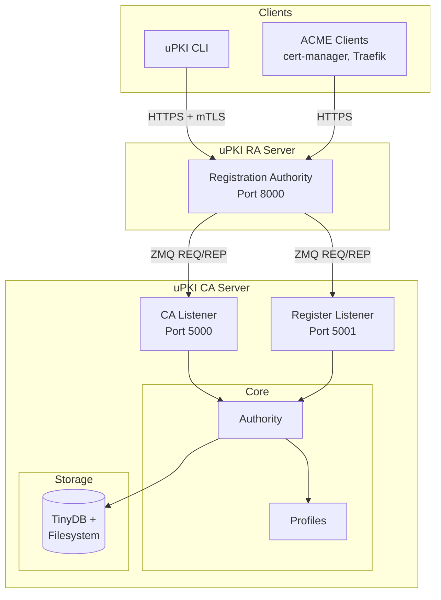

# uPKI CA Server

[](https://opensource.org/licenses/MIT)
[](https://www.python.org/)
[](https://github.com/astral-sh/ruff)
[](https://pypi.org/project/upki-ca/)

Certificate Authority (CA) Server for the uPKI Public Key Infrastructure system. Manages the full certificate lifecycle and exposes PKI operations to Registration Authorities over a ZeroMQ protocol.

## Overview

The uPKI CA Server is the trust anchor of the uPKI ecosystem. It runs as a persistent background process listening on two dedicated ZMQ ports:

- **Port 5000** — CA operations: certificate signing, renewal, revocation, CRL generation, OCSP checks
- **Port 5001** — RA registration: initial handshake to onboard a new Registration Authority

It is designed to operate standalone or in a containerised stack together with [uPKI RA Server](https://github.com/circle-rd/upki-ra) and [uPKI CLI](https://github.com/circle-rd/upki-cli).

## Architecture



## Key Features

- **Certificate Lifecycle** — Sign, renew, revoke, and delete certificates via ZMQ commands
- **CRL Management** — Generate and serve Certificate Revocation Lists on demand
- **OCSP Checks** — Real-time certificate status verification
- **Certificate Profiles** — Built-in and custom profiles with configurable key type, validity, extensions, and SANs
- **RA Registration** — Seed-based handshake to securely onboard Registration Authorities
- **Import Existing CA** — Bootstrap from an existing key/certificate pair (`--ca-key` / `--ca-cert`)
- **Docker Auto-bootstrap** — Single `start` command initialises the PKI on first boot then runs both listeners
- **Multiple Storage Backends** — File-based storage (default, powered by TinyDB) with a MongoDB interface stub

## Requirements

- Python 3.11+
- Poetry (package manager)
- cryptography library

## Installation

### From PyPI

```bash
pip install upki-ca
```

### From Source

```bash
git clone https://github.com/circle-rd/upki-ca.git
cd upki-ca
poetry install
```

### Development Installation

```bash
poetry install --with dev,lint
```

## CLI Usage

The main entry point is `ca_server.py`. All commands accept `--path <dir>` to override the default storage location (`~/.upki/ca`).

### Initialize the PKI

Creates the CA key and certificate on first run. Idempotent on subsequent runs.

```bash
# Generate a fresh CA
poetry run python ca_server.py init

# Import an existing CA key and certificate
poetry run python ca_server.py init --ca-key ca.key --ca-cert ca.crt

# Import a password-protected key
poetry run python ca_server.py init --ca-key ca.key --ca-cert ca.crt --ca-password-file /run/secrets/ca_pass
```

A registration seed is printed on first `init`. Keep it secure — the RA operator will need it.

### Register a Registration Authority

Starts the registration listener (port 5001, clear mode) and waits for the RA to complete the handshake.

```bash
poetry run python ca_server.py register
```

### Start the CA Server

Starts the CA listener (port 5000, TLS mode). The RA must already be registered.

```bash
# Default: tcp://127.0.0.1:5000
poetry run python ca_server.py listen

# Custom bind address
poetry run python ca_server.py listen --host 0.0.0.0 --port 5000
```

### Auto-bootstrap (Docker / Production)

Initialises the PKI on the first boot (or skips it if already done), then runs both listeners concurrently. This is the default Docker entrypoint.

```bash
poetry run python ca_server.py start
```

## Configuration

On first run, `ca_server.py init` creates `ca.config.yml` in the storage directory with the following defaults:

```yaml
company: "Company Name"
domain: "example.com"
host: "127.0.0.1"
port: 5000 # CA listener; registration listener uses port + 1
clients: "register" # all | register | manual
password: null # CA private key password (null = no encryption)
seed: null # RA registration seed (auto-generated if absent)
key_type: "rsa" # rsa | dsa
key_length: 4096
digest: "sha256" # md5 | sha1 | sha256 | sha512
crl_validity: 7 # CRL validity in days
```

### Environment Variables

When running via Docker or systemd, configuration can be injected without editing the config file:

| Variable            | Description                                           |
| ------------------- | ----------------------------------------------------- |
| `UPKI_DATA_DIR`     | Override the storage path (`--path` equivalent)       |
| `UPKI_CA_SEED`      | Registration seed (used by `start` on first boot)     |
| `UPKI_CA_HOST`      | Bind address for both ZMQ sockets (default `0.0.0.0`) |
| `UPKI_CA_KEY_FILE`  | Path to an existing CA private key to import          |
| `UPKI_CA_CERT_FILE` | Path to an existing CA certificate to import          |

## Certificate Profiles

Profiles are stored as YAML files under `~/.upki/ca/profiles/`. The following built-in profiles are created automatically at initialisation:

| Profile  | Type     | Default Validity | Key Usage                             |
| -------- | -------- | ---------------- | ------------------------------------- |
| `ca`     | `sslCA`  | 10 years         | `keyCertSign`, `cRLSign`              |
| `ra`     | `sslCA`  | 1 year           | `digitalSignature`, `keyEncipherment` |
| `server` | `server` | 60 days          | `serverAuth`                          |
| `webapp` | `server` | 60 days          | `serverAuth`, `clientAuth`            |
| `laptop` | `user`   | 30 days          | `clientAuth`, `emailProtection`       |
| `user`   | `user`   | 30 days          | `clientAuth`                          |
| `admin`  | `user`   | 1 year           | `clientAuth`                          |

Custom profiles can be added by dropping a YAML file in the `profiles/` directory.

## Docker Deployment

### Using Docker Run

```bash
docker run -d \
  --name upki-ca \
  -p 5000:5000 \
  -p 5001:5001 \
  -v upki_data:/data \
  -e UPKI_DATA_DIR=/data \
  -e UPKI_CA_SEED=<your-seed> \
  ghcr.io/circle-rd/upki-ca:latest
```

### Using Docker Compose

```yaml
services:
  upki-ca:
    image: ghcr.io/circle-rd/upki-ca:latest
    ports:
      - "5000:5000"
      - "5001:5001"
    volumes:
      - upki_data:/data
    environment:
      UPKI_DATA_DIR: /data
      UPKI_CA_SEED: ${CA_SEED}
    restart: unless-stopped

volumes:
  upki_data:
```

### Build from Source

```bash
docker build -t upki-ca:latest .
```

## Project Organization

```
upki-ca/
├── ca_server.py              # Main entry point (CLI)
├── pyproject.toml            # Poetry configuration
├── Dockerfile                # Docker image definition
├── docs/
│   ├── CA_ZMQ_PROTOCOL.md   # ZMQ protocol specification
│   └── SPECIFICATIONS_CA.md # CA specifications
├── upki_ca/
│   ├── ca/
│   │   ├── authority.py      # Core CA singleton (sign, revoke, renew…)
│   │   ├── cert_request.py   # CSR parsing and validation
│   │   ├── private_key.py    # Private key generation / import
│   │   └── public_cert.py    # Certificate building and serialisation
│   ├── connectors/
│   │   ├── listener.py       # Base ZMQ REP socket
│   │   ├── zmq_listener.py   # CA operations dispatcher (port 5000)
│   │   └── zmq_register.py   # RA registration handler (port 5001)
│   ├── core/
│   │   ├── common.py         # Base class with shared utilities
│   │   ├── options.py        # Allowed values, profiles, durations
│   │   ├── upki_error.py     # Custom exception hierarchy
│   │   ├── upki_logger.py    # Logging setup
│   │   └── validators.py     # Input validation (DN fields, SANs…)
│   ├── storage/
│   │   ├── abstract_storage.py # Storage interface
│   │   ├── file_storage.py     # TinyDB + filesystem (default)
│   │   └── mongo_storage.py    # MongoDB stub (not yet implemented)
│   └── utils/
│       ├── config.py           # YAML config loader / writer
│       └── profiles.py         # Profile management
└── tests/
    ├── test_00_common.py
    ├── test_10_config.py
    ├── test_10_validators.py
    ├── test_20_ca_server.py
    ├── test_20_profiles.py
    └── test_100_pki_functional.py
```

## CA ZMQ Operations

The CA exposes the following commands on port 5000. See [docs/CA_ZMQ_PROTOCOL.md](docs/CA_ZMQ_PROTOCOL.md) for the full message format.

| Command        | Description                           |
| -------------- | ------------------------------------- |
| `get_ca`       | Retrieve the CA certificate           |
| `get_crl`      | Retrieve the current CRL              |
| `generate_crl` | Force CRL regeneration                |
| `generate`     | Generate a key pair and sign a cert   |
| `sign`         | Sign an external CSR                  |
| `renew`        | Renew an existing certificate         |
| `revoke`       | Revoke a certificate                  |
| `unrevoke`     | Remove a certificate from the CRL     |
| `delete`       | Delete a certificate record           |
| `view`         | Retrieve certificate details          |
| `ocsp_check`   | Check the revocation status of a cert |

## Development

### Running Tests

```bash
poetry run pytest tests/
```

### Code Style

```bash
poetry run ruff check .
poetry run ruff format .
```

## Related Projects

- [uPKI RA Server](https://github.com/circle-rd/upki-ra) — Registration Authority, bridges clients to this CA
- [uPKI CLI](https://github.com/circle-rd/upki-cli) — Client application for certificate enrolment and renewal

## License

MIT License
